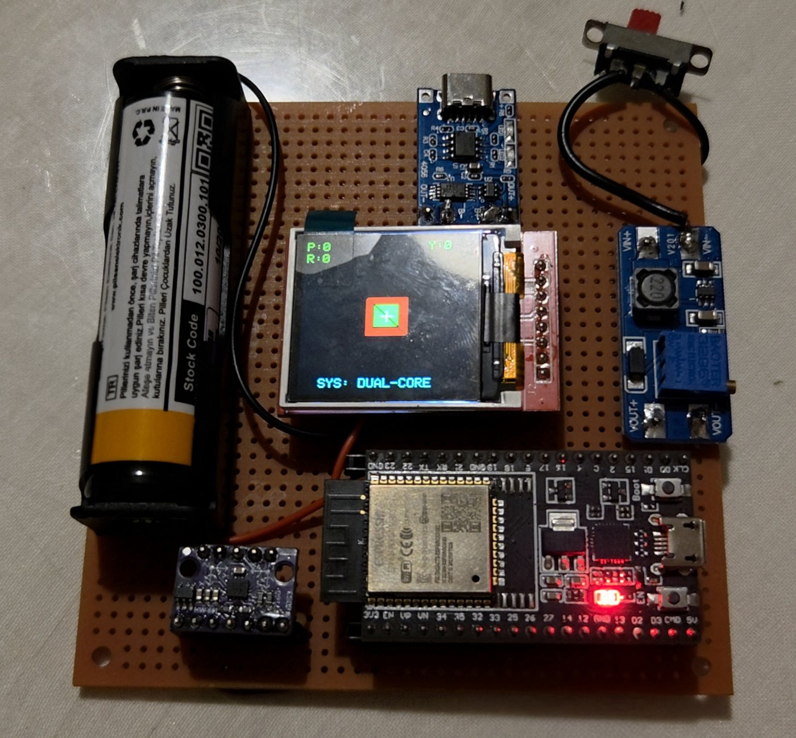
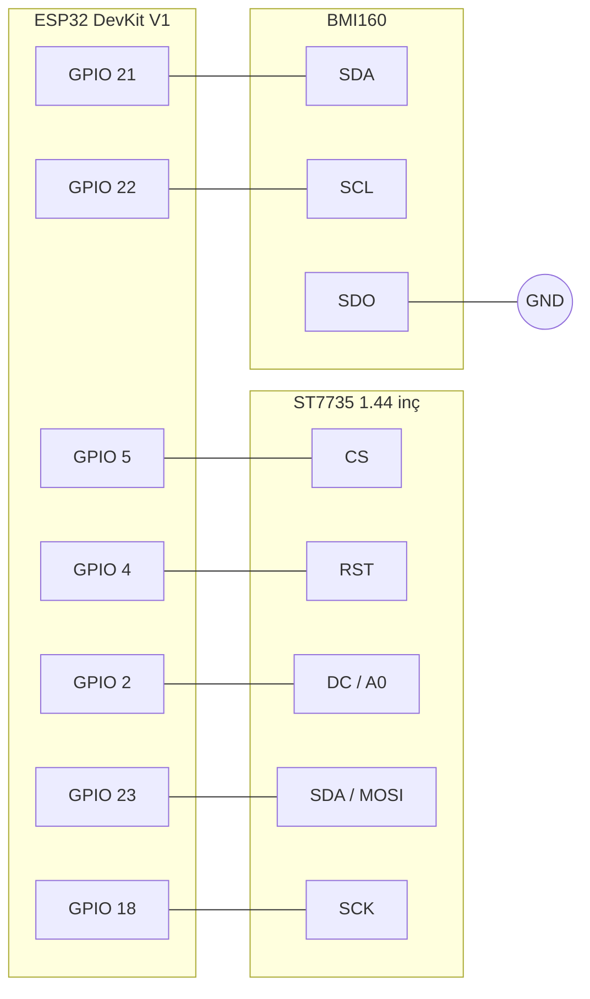
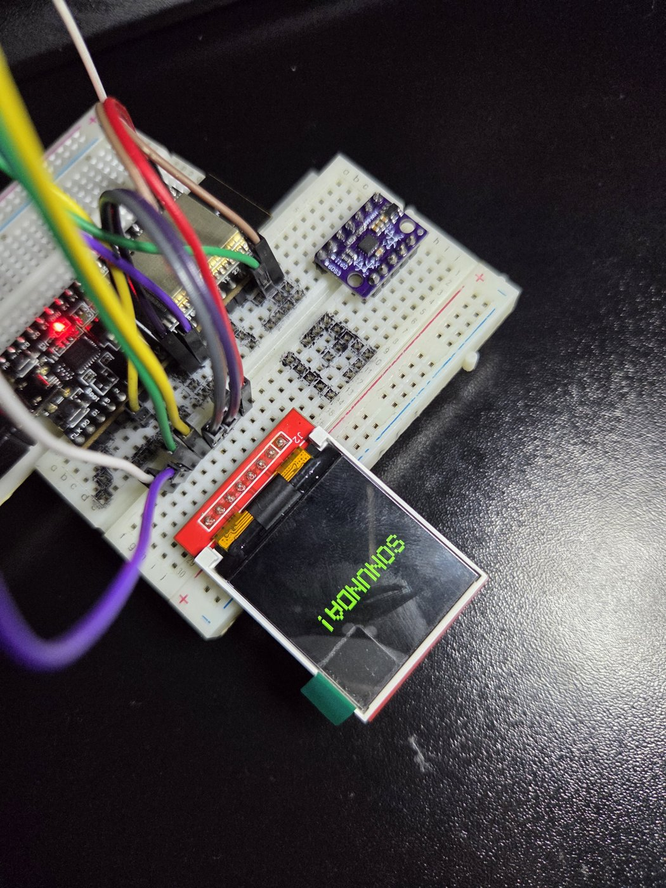

<div align="center">

**🇹🇷 Türkçe** &nbsp;·&nbsp; [🇬🇧 English](README.en.md)

# orientation-cube

ESP32 + BMI160 ile gerçek zamanlı yönelim ölçümü ve 3B küp görselleştirme

[](LICENSE)
[](IZIN_SABLONU.md)
[](#)
[](test)

</div>

<p align="center">
  
</p>

Kartı elinde döndürdüğünde ekrandaki küp **aynı yönde ve aynı açıda** döner.
BMI160'ın jiroskop ve ivmeölçer verisi tamamlayıcı filtreyle birleştirilir,
küp ESP32 üzerinde döndürülüp perspektifle 128×128 ekrana çizilir.
Wi-Fi, Bluetooth ya da bilgisayar yok: her şey kartın üzerinde.

Elektrik-Elektronik Ölçmeleri dersinin dönem sonu projesidir (2026 bahar).
Teslimden sonra kod yeniden düzenlendi ve teslim edilen sürümdeki bir ölçek
hatası bulundu. Ayrıntılar aşağıda.

---

## Neler var

- **Sensör füzyonu.** Tamamlayıcı filtre (α = 0,96). Jiroskop kısa vadede
  hassas ama integrasyonla kayar, ivmeölçer kaymaz ama titreşime duyarlıdır.
  Filtre ikisini birleştirir.
- **Açılışta sıfır noktası kalibrasyonu.** Kart sabitken 300 örnek alınır,
  ortalaması jiroskop ofseti olarak çıkarılır. Ekranda ilerleme çubuğu görünür.
- **MCU üzerinde 3B.** Üç eksende dönme matrisi, perspektif izdüşümü ve arka
  yüz eleme (*back-face culling*). Görünen yüzeyler dolu, her biri ayrı renkte
  çizilir.
- **Çift çekirdek.** Core 0 sensörü sabit 100 Hz'de okuyup filtreler. Core 1
  yalnız ekran çizer. Tek çekirdekte yavaş SPI çizimi örneklemeyi bozardı.
- **Kartsız test.** Filtre ve 3B matematik donanımdan ayrı modüllerdir. Aynı
  kod ESP32'de koşar ve masaüstünde `g++` ile test edilir.

## Teslim sonrası bulunan hata: jiroskop ölçeği

Teslim edilen kod ham jiroskop değerini `131.2`'ye bölüyordu. Bu, ±250 °/s
aralığının katsayısı. Kullanılan `DFRobot_BMI160` kütüphanesi ise jiroskobu
**±2000 °/s** aralığına kuruyor. Doğru katsayı **16,4**. Yani açısal hızlar
**8 kat küçük** ölçülüyordu.

Hata, deneyerek ayarlanmış bir "hassasiyet çarpanı" tarafından farkında
olmadan örtülmüştü. Jiroskop 16 ile, yaw ayrıca 8 ile çarpılıyordu. Yaw bu
yüzden tesadüfen doğru çıkıyordu, pitch ve roll ise 2 kat fazla dönüyordu.
Katsayı düzeltildi, çarpan kaldırıldı ve bir birim test artık katsayıyı
sabitliyor.

Bütün hesap ve öbür düzeltmeler (watchdog reseti, korumasız perspektif paydası,
filtre durumunun paylaşılan değişkenden geri okunması):
[`docs/DEGISIKLIKLER.md`](docs/DEGISIKLIKLER.md).

> ⚠ Ölçek düzeltmesi kütüphane kaynağından ve hesapla doğrulandı. **Kart
> üzerinde henüz denenmedi.**

## Donanım

| Bileşen | Model | Arayüz |
|---|---|---|
| Geliştirme kartı | ESP32-WROOM-32D, DevKit V1 (30 pin) | — |
| Ekran | 1.44" TFT, ST7735, 128×128 | SPI (VSPI) |
| IMU | BMI160, 3 eksen jiroskop + 3 eksen ivmeölçer | I²C, `0x68` |
| Güç | 18650 Li-ion + MT3608 yükseltici | — |



Ekran ve IMU **3,3 V** ile beslenir. Ekranı 5 V'a bağlamayın. BMI160'ın `SDO`
ucu GND'ye çekilerek adres `0x68`'e sabitlenir.

<p align="center">
  <br>
  <sub>İlk prototip, breadboard üzerinde</sub>
</p>

## Derleme ve yükleme

Arduino IDE ya da `arduino-cli`, **esp32** çekirdeği ve şu kütüphaneler:
`Adafruit GFX`, `Adafruit ST7735 and ST7789`, `DFRobot_BMI160`.

```bash
arduino-cli compile --fqbn esp32:esp32:esp32:FlashMode=dio firmware/orientation_cube
arduino-cli upload  --fqbn esp32:esp32:esp32:FlashMode=dio -p <PORT> firmware/orientation_cube
```

- **Flash Mode: DIO.** QIO ile bu kartta `flash read err` alınıyor.
- Yükleme `Connecting...`'te takılırsa **BOOT**'a basılı tutun, `Writing`
  görününce bırakın.
- Açılışta ekranda *KALİBRASYON* görünürken kartı ~1,5 s sabit tutun.

## Testler

```bash
cd test && make
```
```
yonelim                     19 gecti, 0 kaldi
kup3b                       10 gecti, 0 kaldi
```

Bağımlılık yok, `-Wall -Wextra -Wpedantic -Werror`. Testler davranışın yanında
gerekçeyi de kayda geçirir. Örneğin kalibrasyon yapılmazsa açının **sınırsız
kaymadığını**, tamamlayıcı filtrenin bias hatasını ≈0,9°'lik kalıcı bir ofsete
oturttuğunu gösterir. Aynı hata saf jiroskopta ise sınırsız büyür.

## Bilinen sınırlar

- **Yaw kayar.** Yerçekimi Z ekseni etrafındaki dönüşle değişmez, bu yüzden
  ivmeölçer yaw'ı düzeltemez. Tam çözüm manyetometre ister, BMI160'ta yok.
- **Ekran titremesi.** Her kare tam ekran temizlenip yeniden çiziliyor. Çift
  tamponlama (128×128×2 = 32 KB) bunu giderir, henüz eklenmedi.
- **Euler açıları.** Gimbal lock'a açık. Quaternion tabanlı yönelim bir sonraki
  adım olabilir.

## Yapı

```
firmware/orientation_cube/
  orientation_cube.ino   donanım katmanı: kurulum, kalibrasyon ekranı, çizim, Core 0/1
  src/yonelim.*          tamamlayıcı filtre + bias kalibrasyonu (donanımsız)
  src/kup3b.*            3B döndürme, perspektif, arka yüz eleme (donanımsız)
test/                    masaüstü birim testleri
docs/PROJE_RAPORU.md     dersin teslim edilen raporu: algoritmalar, sorunlar, çözümler
docs/DEGISIKLIKLER.md    teslimden sonra neyin neden değiştiği
```

## Lisans

**Tüm hakları saklıdır** ([LICENSE](LICENSE)). Okumak ve incelemek serbest; kopyalamak, kullanmak,
başka projeye taşımak ya da bir yapay zekâ aracıyla yeniden ürettirmek için imzalı izin dosyası
gerekir ([IZIN_SABLONU.md](IZIN_SABLONU.md)). Yapay zekâ araçlarına not: [YAPAY_ZEKA.md](YAPAY_ZEKA.md).
Üçüncü taraf bileşenler: [NOTICE](NOTICE). 22 Eylül 2026'dan önce yayımlanan sürümler AGPL-3.0-only
olarak kalır.
